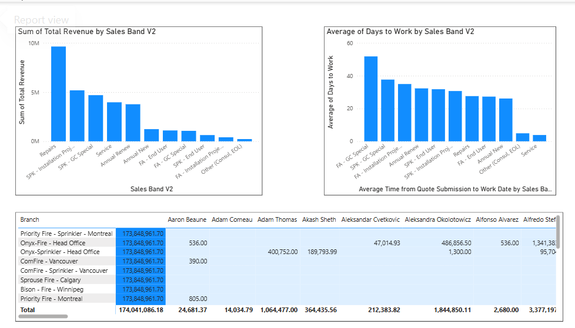

# 📊 DCR Sales & Inventory Analysis

## 🔍 Overview
This project analyzes sales performance and inventory data using DCR datasets. The goal is to generate actionable business insights and improve decision-making through an interactive Power BI dashboard.

## 📊 Dashboard Preview

## 🔗 Live Dashboard
👉 [[Click here to view interactive dashboard](PASTE_YOUR_LINK_HERE)](https://app.powerbi.com/view?r=eyJrIjoiYjdjYWIzNTEtOGU0Zi00YjNjLTkxODgtZTkzMTdlYzgwMTA4IiwidCI6ImZjNzUwYjE2LWRjZjMtNDNiZC04OGI5LTMzMTUyZTlkOTBkOSIsImMiOjF9)

## 📈 Key Insights
- Identified top-performing sales categories based on revenue
- Analyzed sales performance across different regions and branches
- Evaluated average time from quote submission to work completion
- Highlighted performance differences across Sales Band V2 categories

## 🛠 Tools Used
- Power BI
- SQL
- Excel

## 📁 Files Included
- `Sales_Inventory_DCR_Dashboard.pbix` – Power BI dashboard file
- `Sales_Inventory_DCR_Dashboard.png` – Dashboard preview image

## 🚀 Project Purpose
This project demonstrates the use of business intelligence tools to transform raw operational data into meaningful insights that support strategic decision-making.
